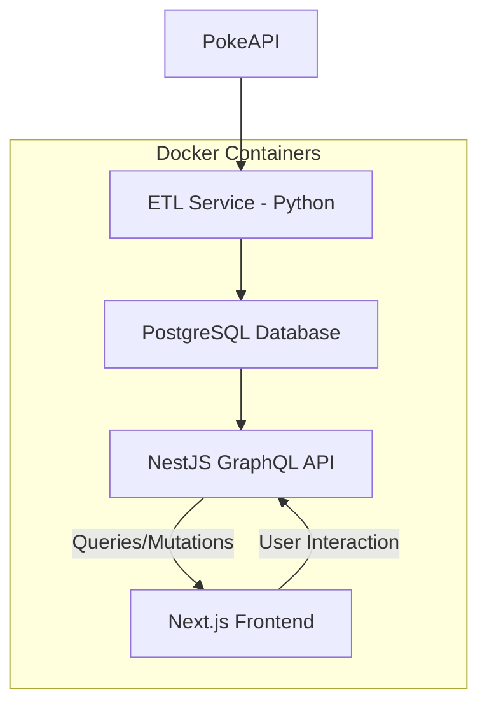
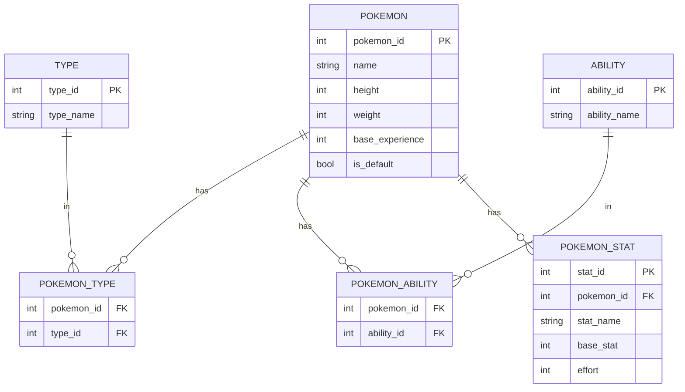

# Pokemon Data Pipeline (Core ETL), GraphQL API & Frontend

## Overview

This project provides a comprehensive solution for fetching, transforming, and serving Pokémon data. It consists of three main components:

1. **PokeAPI Data Pipeline (Core ETL)**: A Python application responsible for extracting Pokémon data from the public PokeAPI, transforming it, and loading it into a PostgreSQL database.
2. **PokeAPI Backend (NestJS GraphQL API)**: A NestJS application that exposes a GraphQL API to query the Pokémon data stored in the PostgreSQL database.
3. **Pokémon Frontend (Next.js)**: A Next.js application that consumes the GraphQL API to display Pokémon data to users.

This modular setup demonstrates a complete full-stack solution, from data ingestion to user interface, focusing on robustness, maintainability, and best practices.

-----

## Core Requirements

This project directly addresses the following core requirements:

- **Data Extraction, Transformation & Loading (ETL)**: Fetches Pokémon data (IDs 1-20), transforms it, and stores it in a PostgreSQL database.
- **GraphQL API**: Provides a robust and flexible API for querying Pokémon data, built with NestJS.
- **Frontend Application**: Consumes the GraphQL API to present Pokémon information, built with Next.js.

-----

## Features and Design Choices

### PokeAPI Data Pipeline (Core ETL)

The following features and design choices were made for this implementation:

- **Modular Architecture**: The ETL process is clearly separated into distinct `extract`, `transform`, and `load` modules, orchestrated by a central `orchestrate.py`. Utility functions and database models reside in separate `utils` and `data_models` directories respectively.
- **Centralized Configuration**: All environment-specific variables, API settings, and logging configurations are managed via a dedicated `utils/config.py` module. This centralizes settings, improves readability, and simplifies environment management.
- **Normalized Schema**: The PostgreSQL database schema (`data_models/models.py`) is designed following relational database best practices to reduce data redundancy and improve data integrity. Separate tables are used for Pokémon, types, abilities, stats, and join tables for many-to-many relationships.
- **Robust API Interaction with Retries**: The data extraction module (`etl/extract/extractor.py`) incorporates advanced retry logic with exponential backoff for transient network issues and specific HTTP server errors (500, 502, 503, 504). This significantly enhances the pipeline's resilience against unreliable API responses.
- **Robust Error Handling**: Comprehensive `try-except` blocks are implemented at each pipeline stage (extraction, loading) to gracefully handle API errors (HTTP errors, connection issues) and database errors, ensuring the pipeline's resilience.
- **API Rate Limiting**: To respect the PokeAPI's usage policies and prevent IP blocking, a configurable delay (`REQUEST_DELAY` in `.env`) is introduced between consecutive API calls.
- **Database Connection Pooling**: The database utility (`utils/database.py`) implements SQLAlchemy's connection pooling (`pool_size`, `max_overflow`, `pool_recycle`). This optimizes database connection management, improving performance and resource utilization, especially for frequent database operations.
- **Idempotent Operations**: The loading module utilizes `session.merge()` from SQLAlchemy. This ensures that running the pipeline multiple times for the same Pokémon IDs will update existing records rather than creating duplicates, making the process idempotent.
- **Environment Configuration**: All sensitive information and configurable parameters (like database credentials, API base URL, request delay) are managed securely using `.env` files and `python-dotenv`, keeping them separate from the codebase.
- **Comprehensive Logging**: Standard Python logging is configured via `utils/logging_config.py` to provide detailed, timestamped messages at various levels (`INFO`, `WARNING`, `ERROR`) and can output to both console and a file (`logs/pokeapi_etl.log`). This enhances observability and debugging capabilities.

### PokeAPI Backend (NestJS GraphQL API)

- **GraphQL Implementation**: Uses `@nestjs/graphql` to build a robust and type-safe GraphQL API, leveraging NestJS's modularity and dependency injection.
- **TypeORM Integration**: Integrates with TypeORM for seamless interaction with the PostgreSQL database, providing an ORM layer for managing entities and queries.
- **Authentication & Authorization (JWT)**: Implements JSON Web Token (JWT) based authentication for securing API endpoints. This includes logic for generating, validating, and refreshing access tokens.
- **Modular Structure**: Organized into feature modules (e.g., `pokemon`, `auth`) for clear separation of concerns, improving maintainability and scalability.
- **DTOs and Validations**: Utilizes Data Transfer Objects (DTOs) with class-validator for input validation, ensuring data integrity and robust API interactions.
- **Environment Configuration**: Manages sensitive information and configurable parameters via `.env` files for secure and flexible deployment.

### Pokémon Frontend (Next.js)

- **React Framework**: Built with Next.js, providing server-side rendering (SSR) and static site generation (SSG) capabilities for improved performance and SEO.
- **GraphQL Client (Apollo Client/Relay/urql)**: Integrated with a GraphQL client (e.g., Apollo Client, Relay, or urql) to efficiently fetch and manage data from the NestJS GraphQL API.
- **Modular Components**: Designed with reusable React components for a clean and maintainable codebase.
- **Responsive Design**: Implements a responsive UI to ensure a consistent user experience across various devices.
- **Environment Variables**: Utilizes Next.js's built-in environment variable support for configuring API endpoints during build and runtime.

-----

## Architecture



This updated architectural diagram reflects the entire system:

1. **A[PokeAPI] --\> B[ETL Service - Python]**: Data is extracted from the public PokeAPI by the Python ETL service.
2. **B[ETL Service - Python] --\> C[PostgreSQL Database]**: The ETL service processes and loads the data into the PostgreSQL database.
3. **C[PostgreSQL Database] --\> D[NestJS GraphQL API]**: The NestJS GraphQL API queries the PostgreSQL database to retrieve Pokémon data.
4. **D[NestJS GraphQL API] -- Queries/Mutations --\> E[Next.js Frontend]**: The Next.js frontend sends GraphQL queries to the NestJS API to fetch data and potentially send mutations (e.g., for user interactions if implemented).
5. **E[Next.js Frontend] -- User Interaction --\> D**: Users interact with the frontend, which in turn communicates with the backend API.
6. **Subgraph "Docker Containers"**: All services (ETL, PostgreSQL, NestJS API, Next.js Frontend) are encapsulated within Docker containers, managed by Docker Compose for easy deployment and orchestration.

-----

## Database Schema



**This diagram reflects the schema defined in `data_models/models.py` file and aligns with good normalized relational database design.**

- **Table and Column Names**: All table and column names match `models.py`.
- **Primary Keys (PK)**: `pokemon_id`, `type_id`, `ability_id`, and `stat_id` are correctly identified as primary keys.
- **Foreign Keys (FK)**: `pokemon_id` and `type_id` in `POKEMON_TYPE`, and `pokemon_id` and `ability_id` in `POKEMON_ABILITY`, and `pokemon_id` in `POKEMON_STAT` are correctly identified as foreign keys referencing their respective parent tables.
- **Relationships**:
  * `POKEMON ||--o{ POKEMON_TYPE`: Correctly shows one Pokémon having many types via the `POKEMON_TYPE` association table (many-to-many relationship effectively).
  * `POKEMON ||--o{ POKEMON_ABILITY`: Correctly shows one Pokémon having many abilities via the `POKEMON_ABILITY` association table.
  * `POKEMON ||--o{ POKEMON_STAT`: Correctly shows one Pokémon having many stats (one-to-many).
  * `TYPE ||--o{ POKEMON_TYPE`: Correctly shows one Type being associated with many Pokémon through `POKEMON_TYPE`.
  * `ABILITY ||--o{ POKEMON_ABILITY`: Correctly shows one Ability being associated with many Pokémon through `POKEMON_ABILITY`.

-----

## Assumptions Made

During the development of this solution, the following assumptions were made:

- **Sequential Extraction**: It's assumed that fetching Pokémon data sequentially by ID (e.g., from 1 to 20) is sufficient for this phase. Parallel fetching was not implemented to keep this phase focused on core ETL logic.
- **Data Completeness**: It's assumed that the PokeAPI will provide consistent and expected data structures for the requested Pokémon. Edge cases for highly malformed or missing data fields were not exhaustively handled beyond basic `KeyError` prevention and `None` checks.
- **Database Availability**: It's assumed that the PostgreSQL database, whether running locally or via Docker, is accessible and properly configured before the ETL pipeline is executed.
- **Local Execution Context**: The entire stack is designed to run in a local development environment using Docker Compose.
- **Simple Authentication**: For the PostgreSQL database, `md5` or `scram-sha-256` password authentication for `localhost` connections is assumed to be sufficient for this local setup.
- **ETL Trigger**: It's assumed that the ETL process will be triggered manually or via an external mechanism (e.g., a simple API endpoint in the NestJS API that orchestrates the ETL run, or a scheduled job).

-----

## Future Improvements / Potential Features

If more time were available, the following improvements and additional features would be considered for subsequent phases:

- **Parallel Data Extraction**: Implement asynchronous API calls (e.g., using `aiohttp` and `asyncio`) or multithreading/multiprocessing to significantly speed up data extraction for larger ranges of Pokémon.
- **Incremental Loads**: Introduce logic to identify and process only new or updated Pokémon data from the API, rather than re-extracting and re-loading all data on every run. This could involve tracking the last fetched ID or using API change logs if available.
- **Advanced Error Handling and Retry Mechanisms**: Implement more sophisticated retry logic with exponential backoff for transient API or database errors.
- **Data Validation**: Add more robust data validation checks after extraction and transformation to ensure data quality before loading into the database.
- **Orchestration Framework Integration**: Integrate the pipeline with a dedicated orchestration tool like Apache Airflow or Prefect for scheduling, monitoring, and managing complex workflows.
- **Advanced Data Transformation**: Explore more complex transformations, such as denormalizing certain data for specific analytical queries or integrating data from other related endpoints (e.g., move data, item data).
- **Performance Optimization**: Profile the ETL process to identify bottlenecks and optimize database insertions (e.g., bulk inserts) or API call patterns.
- **API Key Management**: For production environments, implement more secure API key management strategies.
- **Alerting and Monitoring**: Set up alerts for pipeline failures or anomalies.
- **Real-time Updates**: Implement WebSockets or subscriptions in the GraphQL API for real-time updates to the frontend (e.g., when new Pokémon data is loaded).
- **Frontend Features**: Add search, filtering, pagination, and detailed Pokémon views to the frontend.
- **Docker Optimization**: Further optimize Docker images for production (multi-stage builds, smaller base images).

-----

## Project Structure

```bash
.
├── docker-compose.yml   # Main Docker Compose configuration for all services
├── .env                 # Environment variables for all services (actual values)
├── .env.example         # Example environment variables for all services
├── pokeapi-be/          # NestJS GraphQL API Application
│   ├── src/
│   │   ├── pokemon/     # Pokémon GraphQL module
│   │   └── ...          # Other NestJS modules
│   ├── .env.example     # Example env for backend specific settings (optional, can be consolidated)
│   ├── Dockerfile       # Dockerfile for NestJS backend
│   ├── package.json     # Node.js dependencies
│   └── tsconfig.json    # TypeScript configuration
├── pokeapi-etl/         # Python ETL Service
│   ├── etl/
│   │   ├── orchestrate.py   # Main ETL controller
│   │   ├── extract/
│   │   ├── transform/
│   │   └── load/
│   ├── data_models/     # SQLAlchemy ORM models
│   ├── utils/           # Utility functions (config, database, logging)
│   ├── tests/           # Unit tests for ETL
│   ├── Dockerfile       # Dockerfile for Python ETL (optional, but good for separate container)
│   ├── requirements.txt # Python dependencies
│   └── logs/            # Log files
└── pokemon-fe/          # Next.js Frontend Application
    ├── public/
    ├── src/
    │   ├── components/  # Reusable React components
    │   ├── pages/       # Next.js pages (routes)
    │   ├── api/         # Next.js API routes (if any)
    │   └── ...          # Other frontend specific code
    ├── .env.example     # Example env for frontend specific settings (optional, can be consolidated)
    ├── Dockerfile       # Dockerfile for Next.js frontend
    ├── package.json     # Node.js dependencies
    └── tsconfig.json    # TypeScript configuration
```

-----

## Getting Started

Follow these steps to set up and run the entire application stack using Docker Compose.

### 1\. Project Setup & Environment

#### 1.1 Clone the Repository and Navigate

If you haven't already, clone the main repository:

```bash
git clone [repo_url]
cd Pok-Pipeline
```

#### 1.2 Configure Environment Files

Create and populate the `.env` file at the **root** of your project. This single `.env` file will be used by `docker-compose` to pass variables to all services.

- **`.env`**: Create this file at the root of your project and copy content from `.env.example`.

    ```bash
    cp .env.example .env
    ```

    **Note**: Adjust `POSTGRES_PASSWORD` to your actual PostgreSQL password if running locally, and you can change other values as needed. Remember to choose strong, unique JWT keys for any production deployment\!

#### 1.3 Ensure Docker is Running

Make sure Docker Desktop (or your Docker daemon) is running on your system.

### 2\. Running the Full Stack

From the **root** of your project (where `docker-compose.yml` is located), execute the following command:

```bash
docker-compose up --build -d
```

This command will:

- Build the Docker images for your Python ETL, NestJS API, and Next.js frontend services.
- Start all services in detached mode (`-d`), including PostgreSQL.
- Ensure that services start in the correct order (PostgreSQL -\> ETL -\> API -\> Frontend) due to `depends_on` and `healthcheck` configurations.

#### Verify Service Status (Optional)

You can check the status of your running containers with:

```bash
docker-compose ps
```

### 3\. Accessing the Applications

Once all services are up and running:

- **NestJS GraphQL API**: You can access the GraphQL Playground/endpoint at `http://localhost:3000/graphql`.
- **Next.js Frontend**: You can access the frontend application at `http://localhost` (or `http://localhost:3001` if you configured `FRONTEND_PORT=3001` in your `.env`).

### 4\. Running the ETL Pipeline (Initial Data Load)

The ETL service is ready to run once the PostgreSQL database is healthy. You'll need to manually trigger the ETL process as it's not set up for continuous execution in this initial setup.

To run the ETL pipeline:

```bash
docker exec pokeapi-etl python -m etl.orchestrate
```

This command executes the `orchestrate.py` script inside the running `pokeapi-etl` container. You can monitor its logs:

```bash
docker logs -f pokeapi-etl
```

After the ETL completes, your PostgreSQL database will be populated with Pokémon data.

### 5\. Verifying Data

You can verify the data in your PostgreSQL database directly from your host or by executing a command inside the `postgres` container.

#### 5.1. Connect to PostgreSQL via `psql` (from your host)

```bash
psql -h localhost -U postgres -d pokemon
# Password: (use the POSTGRES_PASSWORD from your .env)
```

#### 5.2. Execute SQL queries

```sql
SELECT * FROM pokemon LIMIT 5;
SELECT * FROM types LIMIT 5;
SELECT * FROM pokemon_types LIMIT 5;
-- And so on for other tables
```

You should see the fetched and transformed Pokémon data populated in the respective tables.

##### Screenshot of populated table of Pokémon data (Example from ETL section)

### 6\. Running Tests (for ETL service)

To run the Python ETL tests:

```bash
docker exec pokeapi-etl pytest tests/ -v
```

-----

## Stopping the Services

To stop and remove all containers, networks, and volumes created by Docker Compose:

```bash
docker-compose down -v
```

The `-v` flag ensures that the `postgres_data` volume is also removed, which will delete all your database data. If you want to keep the database data for subsequent runs, omit `-v`.
