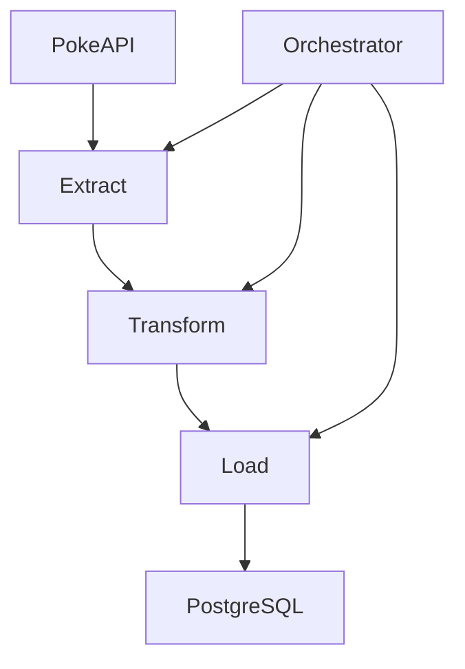
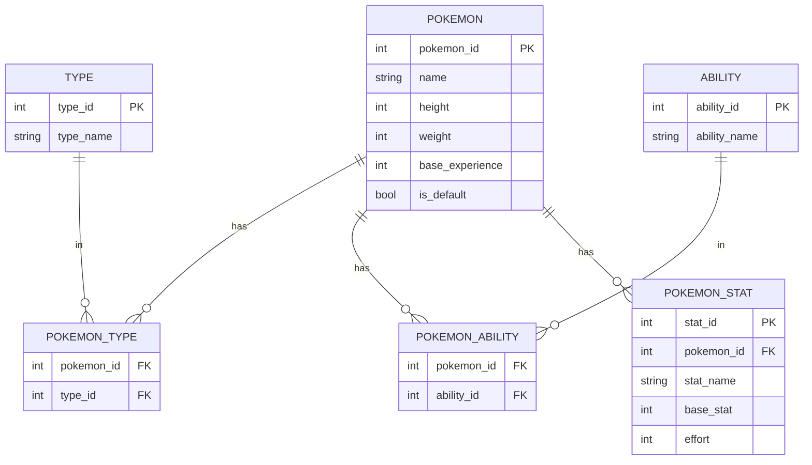

# PokeAPI Data Pipeline (Core ETL)

## Overview

This project implements the first phase of a data pipeline tasked with fetching data about Pokémon from the public PokeAPI ( [pokeapi.co](pokeapi.co) ), transforming this data into a structured format, and storing it in a PostgreSQL relational database.
It demonstrates a modular approach to **ETL** (`Extract`, `Transform`, `Load`), focusing on robustness, maintainability, and best practices for data ingestion.

---

## Core Requirements

It directly addresses the following core requirements of the challenge:

- **Data Extraction**: Fetches data for Pokémon (IDs 1-20) from the PokeAPI, including main Pokémon data, species data, and evolution chain data.
- **Data Transformation & Mapping**: Transforms the raw, often nested, JSON data from the API into a normalized, structured format suitable for a relational database, adhering to a defined schema.
- **Data Loading**: Stores the transformed Pokémon data, types, abilities, and stats into a PostgreSQL database.

---

## Features and Design choices

The following features and design choices were made for this implementation:

- **Modular Architecture**: The ETL process is clearly separated into distinct `extract`, `transform`, and `load` modules, orchestrated by a central `orchestrate.py`. Utility functions and database models reside in separate `utils` and `data_models` directories respectively.
- **Centralized Configuration**: All environment-specific variables, API settings, and logging configurations are managed via a dedicated `utils/config.py` module. This centralizes settings, improves readability, and simplifies environment management.
- **Normalized Schema**: The PostgreSQL database schema (`data_models/models.py`) is designed following relational database best practices to reduce data redundancy and improve data integrity. Separate tables are used for Pokémon, types, abilities, stats, and join tables for many-to-many relationships.
- **Robust API Interaction with Retries**: The data extraction module (`etl/extract/extractor.py`) now incorporates advanced retry logic with exponential backoff for transient network issues and specific HTTP server errors (500, 502, 503, 504). This significantly enhances the pipeline's resilience against unreliable API responses.
- **Robust Error Handling**: Comprehensive `try-except` blocks are implemented at each pipeline stage (extraction, loading) to gracefully handle API errors (HTTP errors, connection issues) and database errors, ensuring the pipeline's resilience.
- **API Rate Limiting**: To respect the PokeAPI's usage policies and prevent IP blocking, a configurable delay (`REQUEST_DELAY` in `.env`) is introduced between consecutive API calls.
- **Database Connection Pooling**: The database utility (`utils/database.py`) implements SQLAlchemy's connection pooling (`pool_size`, `max_overflow`, `pool_recycle`). This optimizes database connection management, improving performance and resource utilization, especially for frequent database operations.
- **Idempotent Operations**: The loading module utilizes `session.merge()` from SQLAlchemy. This ensures that running the pipeline multiple times for the same Pokémon IDs will update existing records rather than creating duplicates, making the process idempotent.
- **Environment Configuration**: All sensitive information and configurable parameters (like database credentials, API base URL, request delay) are managed securely using `.env` files and `python-dotenv`, keeping them separate from the codebase.
- **Comprehensive Logging**: Standard Python logging is configured via utils/logging_config.py to provide detailed, timestamped messages at various levels (`INFO`, `WARNING`, `ERROR`) and can output to both console and a file (`logs/pokeapi_etl.log`). This enhances observability and debugging capabilities.

---

## Architecture



This simple architectural diagram reflects the current architecture of Python ETL pipeline.

  1. A[PokeAPI] --> B[Extract]: Correctly shows data being pulled from the external API by the Extraction module.
  2. B[Extract] --> C[Transform]: Correctly shows extracted data being passed to the Transformation module.
  3. C[Transform] --> D[Load]: Correctly shows transformed data being passed to the Loading module.
  4. D[Load] --> E[PostgreSQL]: Correctly shows data being loaded into the PostgreSQL database.
  5. F[Orchestrator] --> B, F --> C, F --> D: Correctly indicates that the Orchestrator (orchestrate.py) controls and sequences the execution of the Extract, Transform, and Load steps.

---

## Database Schema



**This diagram reflects the schema defined in `data_models/models.py` file and aligns with good normalized relational database design.**

- **Table and Column Names**: All table and column names match `models.py`.
- **Primary Keys (PK)**: `pokemon_id`, `type_id`, `ability_id`, and `stat_id` are correctly identified as primary keys.
- **Foreign Keys (FK)**: `pokemon_id` and `type_id` in `POKEMON_TYPE`, and `pokemon_id` and `ability_id` in `POKEMON_ABILITY`, and `pokemon_id` in `POKEMON_STAT` are correctly identified as foreign keys referencing their respective parent tables.
- **Relationships**:
  - `POKEMON ||--o{ POKEMON_TYPE`: Correctly shows one Pokémon having many types via the `POKEMON_TYPE` association table (many-to-many relationship effectively).
  - `POKEMON ||--o{ POKEMON_ABILITY`: Correctly shows one Pokémon having many abilities via the `POKEMON_ABILITY` association table.
  - `POKEMON ||--o{ POKEMON_STAT`: Correctly shows one Pokémon having many stats (one-to-many).
  - `TYPE ||--o{ POKEMON_TYPE`: Correctly shows one Type being associated with many Pokémon through `POKEMON_TYPE`.
  - `ABILITY ||--o{ POKEMON_ABILITY`: Correctly shows one Ability being associated with many Pokémon through `POKEMON_ABILITY`.

---

## Assumptions Made

During the development of this solution, the following assumptions were made:

- **Sequential Extraction**: It's assumed that fetching Pokémon data sequentially by ID (e.g., from 1 to 20) is sufficient for this phase. Parallel fetching was not implemented to keep this phase focused on core ETL logic.
- **Data Completeness**: It's assumed that the PokeAPI will provide consistent and expected data structures for the requested Pokémon. Edge cases for highly malformed or missing data fields were not exhaustively handled beyond basic `KeyError` prevention and `None` checks.
- **Database Availability**: It's assumed that the PostgreSQL database, whether running locally or via Docker, is accessible and properly configured before the ETL pipeline is executed.
- **Local Execution Context**: The pipeline is designed to run in a local development environment. Deployment considerations (e.g., containerization of the Python app itself, orchestration tools like Airflow) are beyond the scope of this initial phase.
- **Simple Authentication**: For the PostgreSQL database, `md5` or `scram-sha-256` password authentication for `localhost` connections is assumed to be sufficient for this local setup.

---

## Future Improvements / Potential Features

If more time were available, the following improvements and additional features would be considered for subsequent phases:

- **Parallel Data Extraction**: Implement asynchronous API calls (e.g., using `aiohttp` and `asyncio`) or multithreading/multiprocessing to significantly speed up data extraction for larger ranges of Pokémon.
- **Incremental Loads**: Introduce logic to identify and process only new or updated Pokémon data from the API, rather than re-extracting and re-loading all data on every run. This could involve tracking the last fetched ID or using API change logs if available.
- **Error Handling and Retry Mechanisms**: Implement more sophisticated retry logic with exponential backoff for transient API or database errors.
- **Data Validation**: Add more robust data validation checks after extraction and transformation to ensure data quality before loading into the database.
- **Orchestration Framework Integration**: Integrate the pipeline with a dedicated orchestration tool like Apache Airflow or Prefect for scheduling, monitoring, and managing complex workflows.
- **Advanced Data Transformation**: Explore more complex transformations, such as denormalizing certain data for specific analytical queries or integrating data from other related endpoints (e.g., move data, item data).
- **Performance Optimization**: Profile the ETL process to identify bottlenecks and optimize database insertions (e.g., bulk inserts) or API call patterns.
- **API Key Management**: For production environments, implement more secure API key management strategies.
- **Alerting and Monitoring**: Set up alerts for pipeline failures or anomalies.

---

## Project Structure

```bash
pokeapi-etl/
├── .env                 # Environment variables (actual values)
├── .env.example         # Example environment variables
├── .gitignore           # Specifies intentionally untracked files to ignore
├── requirements.txt     # Python dependencies
├── docker-compose.yml   # Docker Compose configuration for PostgreSQL
├── etl/
│   ├── orchestrate.py   # Main ETL controller to run the pipeline
│   ├── extract/
│   │   └── extractor.py # Handles data extraction from PokeAPI
│   ├── transform/
│   │   └── transformer.py # Transforms raw API data into structured format
│   └── load/
│       └── loader.py    # Loads transformed data into PostgreSQL
├── data_models/
│   └── models.py        # SQLAlchemy ORM models defining database schema
├── utils/
│   ├── config.py        # Centralized application configuration
│   ├── database.py      # Handles database connection pooling and session management
│   ├── logging_config.py# Configures application-wide logging
│   └── helpers.py       # General utility functions (e.g., request delay)
├── tests/
│   ├── conftest.py      # Pytest fixtures for test setup (e.g., DB session, mocks)
│   ├── test_extractor.py # Unit tests for data extraction module
│   ├── test_transformer.py # Unit tests for data transformation module
│   └── test_loader.py   # Unit tests for data loading module
└── logs/
    └── pokeapi_etl.log  # Log file for pipeline execution (created by logging_config)

```

---

## Getting Started

Follow these steps to set up and run the ETL pipeline on your local machine.

### 1. Project Setup & Environment

#### 1.1 Clone the Repository and Navigate

If you haven't already, clone the main repository and navigate into the `pokeapi-etl` directory:

```bash
git clone [repo]
cd Pok-Pipeline/pokeapi-etl
```

#### 1.2 Configure Environment Files

Create and populate the `.env.example` and `.env` files with your configuration.

- **`.env.example`**:

    ```env
    # PostgreSQL Configuration
    POSTGRES_USER=username(i.e. postgres)
    POSTGRES_PASSWORD=password
    POSTGRES_DB=database(i.e. pokemon)
    POSTGRES_HOST=localhost
    POSTGRES_PORT=5432

    # API Configuration
    POKEAPI_BASE_URL=https://pokeapi.co/api/v2/
    REQUEST_DELAY=0.1   # Delay between API calls (seconds)
    API_RETRIES=3       # Number of retries for API requests
    API_BACKOFF_FACTOR=0.5 # Factor for exponential backoff between API retries

    # Logging
    LOG_LEVEL=INFO      # Logging level (DEBUG, INFO, WARNING, ERROR, CRITICAL)
    LOG_FILE=logs/pokeapi_etl.log # Path to the log file
    ```

- **`.env`**: Create this file and copy content from `.env.example` or you can simply run this command at root level:

    ```cmd
    cp .env.example .env
    ```

  **Note**: Adjust `POSTGRES_PASSWORD` to your actual PostgreSQL password if running locally, and you can change other values as needed for local testing.

#### 1.3 Install Dependencies

It's recommended to use a Python virtual environment.

```bash
python -m venv venv
source venv/bin/activate    # On Linux/Mac
# venv\Scripts\activate     # On Windows

pip install -r requirements.txt
# If requirements.txt is empty or missing, or to ensure all are covered:
pip install requests sqlalchemy psycopg2-binary pandas python-dotenv pytest pytest-mock
```

#### 1.4 Docker Compose Setup (for PostgreSQL Database)

Make sure `docker-compose.yml` file is in your `pokeapi-etl` root directory:

- **Docker compose**:

    **Start the PostgreSQL container:**

    ```bash
    docker-compose up -d
    ```

    This command will start a PostgreSQL database server in a Docker container in the background.

    **Verify Connection (Optional but Recommended):**
    You can test the connection to your Dockerized PostgreSQL database using `psql`:

    ```bash
    psql -h localhost -U postgres -d pokemon
    # Password: (use password which is set in .env)
    ```

    If successful, you will see a `psql` prompt. Type `\q` to exit.

---

### 2. Running the ETL Pipeline

Once the PostgreSQL container is running and your Python dependencies are installed, you can execute the ETL pipeline:

#### 2.1 Ensure your virtual environment is active

```bash
    source venv/bin/activate
```

#### 2.2 Run the orchestration script

```bash
    python -m etl.orchestrate
    ## or
    python etl/orchestrate.py
```

The pipeline will start fetching data for Pokémon IDs 1-20, transform it, and load it into your PostgreSQL database. You will see logging output indicating the progress.

##### Screenshot of orchestration result


---

### 3. Verifying Output

After the pipeline completes, you can verify the data loaded into your PostgreSQL database.

#### 3.1. Connect to your PostgreSQL database using `psql`

```bash
    psql -h localhost -U postgres -d pokemon
    # Password: (use password which is set in .env)
```

#### 3.2. Execute SQL queries to inspect the data

```sql
    SELECT * FROM pokemon LIMIT 5;
    SELECT * FROM types LIMIT 5;
    SELECT * FROM pokemon_types LIMIT 5;
    SELECT * FROM abilities LIMIT 5;
    SELECT * FROM pokemon_abilities LIMIT 5;
    SELECT * FROM pokemon_stats LIMIT 5;
```

You should see the fetched and transformed Pokémon data populated in the respective tables.

##### Screenshot of populated table of Pokémon data


---

### 4. Running Tests

```bash
pytest tests/ -v

```
##### Screenshot of unit test


---

### 5. Run pipeline with debug logging

```bash
LOG_LEVEL=DEBUG python -m etl.orchestrate
```

---

### 6. View logs

```bash
tail -f logs/pokeapi_etl.log
```

---

### 7. Verify database

```bash
docker exec -it pokeapi-etl-postgres-1 psql -U postgres -d pokemon -c "SELECT * FROM pokemon"
```

---
